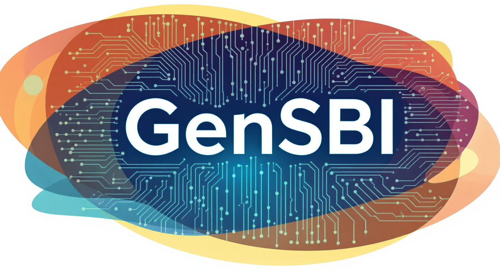

# GenSBI

**Warning**: This library is in an early stage of development and will change significantly in the future.

## Overview

**GenSBI** is a library for Simulation-Based Inference (SBI) adopting Optimal Transport Flow Matching and Diffusion models in JAX. It provides tools for probabilistic modeling and simulation, inspired by cutting-edge research and implementations, including:

- **Facebook Flow Matching library**: [https://github.com/facebookresearch/flow_matching]
- **Elucidating the Design Space of Diffusion-Based Generative Models**: [https://github.com/NVlabs/edm]
- **Simformer model**: [https://github.com/mackelab/simformer]
- **Flux1 model from BlackForest Lab**: [https://github.com/black-forest-labs/flux]

## Contents

### `src/`
The `src` directory contains the core implementation of the library:

- **Flow Matching**: Implements flow matching techniques, including paths, solvers, and utilities.
- **Diffusion**: Contains diffusion models and utilities for training and evaluation.
- **Models**:
  - **Flux1**: A transformer-based architecture for flow matching on sequences.
  - **Simformer**: Implements the Simformer model for all-in-one simulation tasks.
- **Loss Functions**: Includes loss functions tailored for flow matching tasks, such as:
  - `FluxCFMLoss`
  - `SimformerCFMLoss`

### Examples
Examples for this library are avaialble separately in the [GenSBI-examples repository](https://github.com/aurelio-amerio/GenSBI-examples)

#### Flow Matching
`flow_matching_2d_unconditional.ipynb` Demonstrates how to use flow matching in 2D.
- `diffusion_2d_unconditional.ipynb` Demonstrates how to use diffusion models in 2D.

#### SBI Benchmarks
- `two_moons`: Contains benchmarks for the two-moons dataset using Flux1 and Simformer models.

These examples showcase training, evaluation, and visualization of flow matching models.

## TODO

The following tasks are planned for future development:

- [x] Implement OT flow matching techniques.
- [x] Implement diffusion models (EDM and score matching).
- [x] Implement Transformer-based models for conditional posterior estimation (Flux1 and Simformer).
- [x] Unify the API for flow matching and diffusion models.
- [ ] Implement wrappers to make training of flow matching and diffusion models similar.
- [ ] Add more examples and benchmarks.
- [ ] Improve documentation and tutorials.
- [ ] Write tests for core functionalities.

## Citation

If you use this library, please consider citing this work and the original methodology papers.

